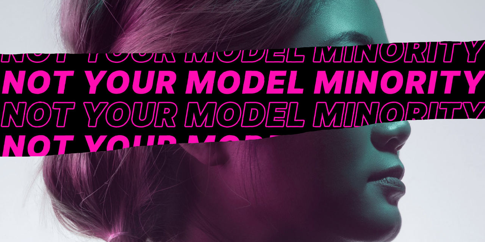

<p id="header"><p>

<table><tr>
<td> <a href="https://github.com/emjose/mousetrail-wandavision/#header"></a> </td>
<td> <a href="https://github.com/emjose/one-hundred/#header"></a> </td>
<td> <a href="https://github.com/emjose/news-site/#header"></a> </td>
</tr></table>

<br>

<p id="project-title"><p>

<a href=#table-of-contents></a>

<br>

<a href="https://emjose.github.io/model-minority-myth/"></a>

#

<p id="table-of-contents"><p>

<a href=#table-of-contents></a>

-   [100 Days of Code](#100days)
-   [Installation](#installation)
-   [Issues](#issues)
-   [Live Site](#live-site)
-   [Resources](#resources)
-   [Copyright](#copyright)
-   [Say Hello](#say-hello)

<br>

#

<p id="100days"><p>

<a href=#100days></a>

### Day 26: April 5, 2021

-   During the Covid-19 pandemic, <a href="https://www.pewresearch.org/social-trends/2020/07/01/many-black-and-asian-americans-say-they-have-experienced-discrimination-amid-the-covid-19-outbreak/">there has been a marked increase in anti-Asian sentiment and racism in the United States.</a>

-   On March 16th, 2021, a mass shooting occured in three Atlanta spas and massage parlors. Eight people were killed, six of whom were Asian women.

-   As an Asian and a Filipino-American, I've been at a loss for words with current events. As a way of beginning to articulate my thoughts, I worked on this mini project with a scratch effect revealing the myth of the **<a href="https://www.learningforjustice.org/magazine/what-is-the-model-minority-myth">"model minority."</a>**

-   The **<a href="https://www.learningforjustice.org/magazine/what-is-the-model-minority-myth">"model minority" myth</a>** is the "one-size-fits-all" and stereotypical perception of Asians being a "polite, law-abiding group who have achieved a higher level of success than the general population through some combination of innate talent and pull-yourselves-up-by-your-bootstraps immigrant striving." Source: <a href="https://www.learningforjustice.org/magazine/what-is-the-model-minority-myth">Learning for Justice.</a>

<br>

#

<p id="installation"><p>

<a href=#installation></a>

#### 1. Git clone and cd into the repo folder:

```console
git clone git@github.com:emjose/model-minority-myth.git && cd model-minority-myth
```

#### 2. Run the command:

```console
open index.html
```

#### 3. On your device, move the cursor around to see the reveal effect.

<br>

#

<p id="issues"><p>

<a href=#issues></a>

#### In the `script.js` file:

```javascript
const bubbles = document.createElement("span");
bubbles.style.left = -75 + e.offsetX + "px";
bubbles.style.top = -75 + e.offsetY + "px";
body.appendChild(bubbles);
```

-   The JavaScript function for the mousemove event creates a span element.

-   For the span to exceed the browser's frame, offset values are added to the mouse coordinates.
    <br>

<a href="https://emjose.github.io/model-minority-myth/"></a>

-   Due to the offset in pixel values, the span can appeared warped or rippled.

-   This warping is most apparent at the bottom of the browser frame.

<br>

#

<p id="live-site"><p>

<a href="https://emjose.github.io/model-minority-myth/"></a>

<a href="https://emjose.github.io/model-minority-myth/"></a>

• **[Model Minority Myth](https://emjose.github.io/model-minority-myth/)** is best viewed on a desktop or laptop computer browser.

• **[Model Minority Myth](https://emjose.github.io/model-minority-myth/)** is a [progressive web app](https://developer.mozilla.org/en-US/docs/Web/Progressive_web_apps).

<br>

#

<p id="resources"><p>

<a href=#resources></a>

-   #### [Stop AAPI Hate](https://stopaapihate.org/)

-   #### [Unsplash Images](https://unsplash.com/)

-   #### [Anti-Asian Violence Resources](https://anti-asianviolenceresources.carrd.co/)

-   #### [What is the Model Minority Myth?](https://www.learningforjustice.org/magazine/what-is-the-model-minority-myth)

-   #### [Stop Asian Hate: GoFundMe Organizations](https://www.gofundme.com/c/act/stop-aapi-hate)

-   #### ["Not Your Model Minority" poem by Rosa Kim](https://bclawimpact.org/2021/02/15/not-your-model-minority/)

-   #### [Scratch Effect Tutorial](https://youtu.be/qzcMiNKPSIk) by [Online Tutorials](https://www.youtube.com/channel/UCbwXnUipZsLfUckBPsC7Jog)

-   #### [The text was created with Adobe Photoshop](https://www.adobe.com/products/photoshop.html)

-   #### [My blog on how I created my Github READMEs](https://emmanueljose.medium.com/readme-a-makeover-story-b9c7be37a6de?sk=7ae6623d365409d875753e4604e42ffd)

<br>

#

<p id="copyright"><p>

<a href=#copyright></a>

-   Special thank you to [Kimson Doan](https://unsplash.com/photos/HD8KlyWRYYM) for her photo on [Unsplash](https://unsplash.com/).

-   Photo copyright of © <a href="https://unsplash.com/@kimsondoan">Kimson Doan</a>. All Rights Reserved.

<br>

#

<p id="say-hello"><p>

<a href=#say-hello></a>

<p><a href="https://twitter.com/Emmanuel_Labor"></a> <a href="https://www.linkedin.com/in/emmanuelpjose/"></a> <a href="https://emmanueljose.medium.com/"></a> <a href="https://www.instagram.com/emmanuel_jose/"></a> <a href="mailto:emjose@gmail.com"></a> <a href="https://www.emmanuel-jose.com/"></a> <a href="https://github.com/emjose"></a></p>

#

<a href=#header></a>
